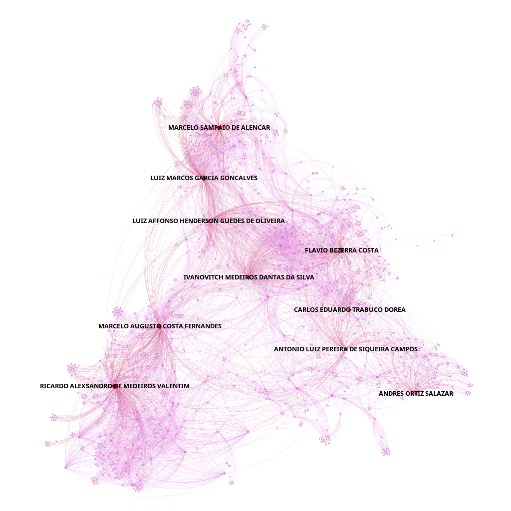
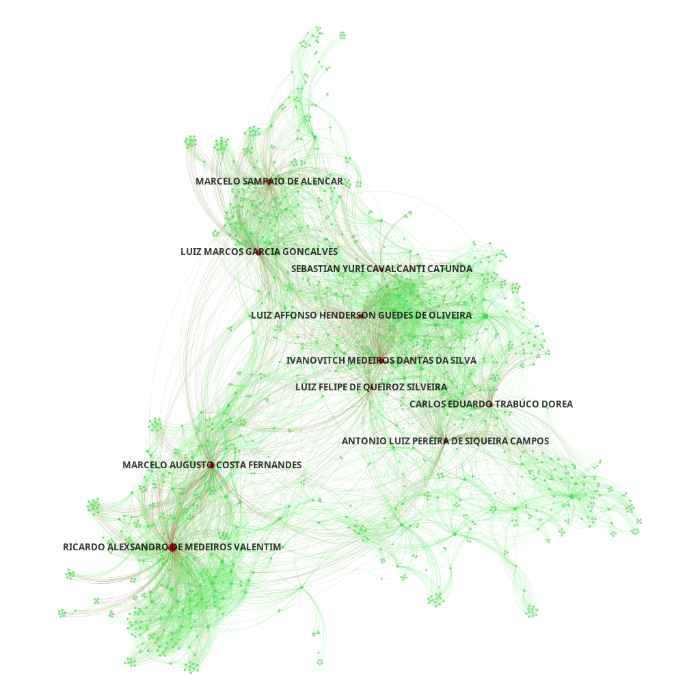
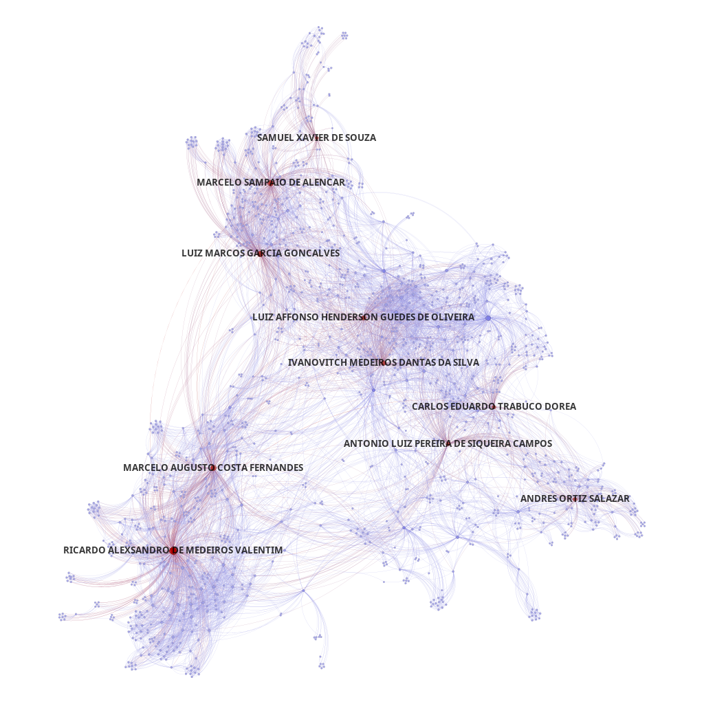
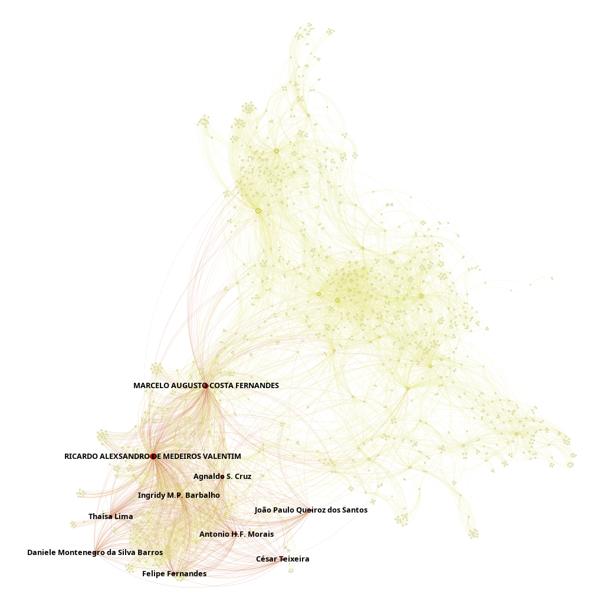
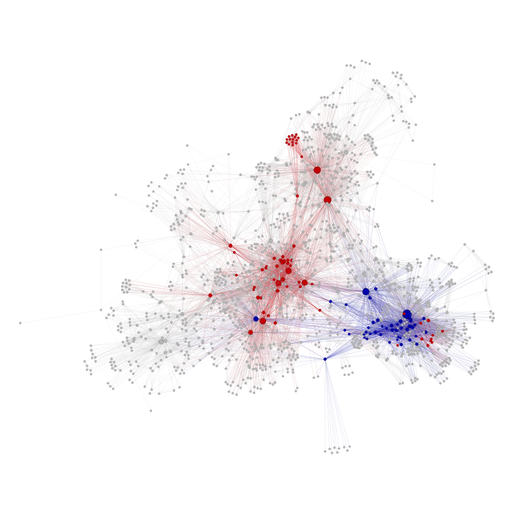

# UFRN Graduate Professors Co-authorship Network :busts_in_silhouette:

## Objective: Create and analyze a co-authorship network using data from Graduate Program in Eletrical and Computer Engineering (PPgEEC) from UFRN.

This project builds and analyzes a co-authorship network using data from Graduate Program in Eletrical and Computer Engineering (PPgEEC) from UFRN. The created graphs will be analyzed based in centrality measurements and core/shell conditions using Gephi to enrich the visualizations of said network.

> ## Federal University of Rio Grande do Norte  
> ## Technology Center  
> ### Department of Computer Engineering and Automation  
> #### Course: **Algorithms and Data Structure II (DCA3702)**  
> #### Author: **João Igor Ramos de Lima :mortar_board:**
>
> This repository contains solutions to the tasks and exercises assigned in the Algorithms and Data Structure II (DCA3702) course.
>
> ### Contact
> [igorservo159@gmail.com](mailto:igorservo159@gmail.com)
>
> Copyright (c) 2024, João Igor Ramos de Lima.  
> All rights reserved.   
> SPDX-License-Identifier: BSD-2-Clause

### [Video explaining the activity](https://www.loom.com/looms/videos)

---

## Centrality Metrics

- **Degree Centrality:** Measures the number of direct connections each node has. 

- **Closeness Centrality:** Calculates the average shortest distance from each node to all other nodes, assessing overall accessibility within the network. 

- **Betweenness Centrality:** Measures the extent to which a node lies on the shortest paths between other nodes, identifying key intermediaries within the network. 

- **Eigenvector Centrality:** Assesses the influence of a node based not only on its direct connections but also on the importance of those connections.

## Implementing Graph Network

### Import Data

```python
import networkx as nx

graph = nx.read_gexf('network.gexf')

for node, data in graph.nodes(data=True):
  data["id"] = data["complete_name"]
  data["label"] = data["complete_name"]
  data.pop("complete_name")
```

### Centrality Measurements

```python
betweenness_centrality = nx.betweenness_centrality(graph)
nx.set_node_attributes(graph, betweenness_centrality, 'betweenness_centrality')

degree_centrality = nx.degree_centrality(graph)
nx.set_node_attributes(graph, degree_centrality, 'degree_centrality')

closeness_centrality = nx.closeness_centrality(graph)
nx.set_node_attributes(graph, closeness_centrality, 'closeness_centrality')

eigenvector_centrality = nx.eigenvector_centrality(graph)
nx.set_node_attributes(graph, eigenvector_centrality, 'eigenvector_centrality')
```

### K-core and K-shell

```python
graph.remove_edges_from(nx.selfloop_edges(graph))
n_cores = sorted(set([v for k, v in nx.core_number(graph).items()]))

if len(n_cores) > 1:
    k_shell = nx.k_shell(graph, k=n_cores[-2])
    k_core = nx.k_core(graph, k=n_cores[-1])
else:
    raise ValueError("A rede possui apenas um nível de k-core.")

nx.set_node_attributes(graph, 0, 'is_core')
nx.set_node_attributes(graph, {n: 1 for n in k_core.nodes()}, 'is_core')
nx.set_node_attributes(graph, {n: 2 for n in k_shell.nodes()}, 'is_core')

print(f"k-core/k-shell list: {n_cores}")
print(f"k-shell info for k = {n_cores[-2]}: {k_shell}")
print(f"k-core info for k = {n_cores[-1]}: {k_core}")
```

### Exporting Graph

```python
nx.write_gexf(graph, 'network_centrality_core.gexf')
nx.write_graphml(graph, "network_centrality_core.graphml")
```

## Centrality Metrics Based Visualization 

In this co-authorship network, centrality metrics are used to analyze and visualize the roles and relationships of authors within the collaboration structure. Each metric provides unique insights into the network's dynamics and the authors' influence, connectivity, or importance. The visualization employs the **ForceAtlas 2** layout, a force-directed algorithm that positions nodes based on their connections, creating an intuitive spatial representation of the network. Highly connected nodes tend to cluster together, while less connected nodes are more dispersed, providing a clear view of the network's structure and the relationships between authors.

### Degree Centrality

Degree centrality highlights the direct connections of each author. Nodes with higher degree centrality are displayed in blue, and their size is proportional to their degree, emphasizing the authors with the most collaborations. The 10 nodes with the highest degree centrality are marked in red, showcasing key contributors who act as major hubs of collaboration. This visualization helps identify prolific authors who connect with many peers, indicating their potential role in facilitating widespread information sharing and cooperation.



> Degree Centrality Visualization

### Closeness Centrality

Closeness centrality measures how quickly an author can access other authors in the network. Nodes with higher closeness centrality are displayed in green, with node size proportional to their degree. The 10 nodes with the highest closeness centrality, marked in red, represent authors with the shortest average distance to all others, making them efficient for spreading ideas and facilitating collaborations. This metric underscores the accessibility and central positioning of these authors in the co-authorship structure.



> Closeness Centrality Visualization

### Betweenness Centrality

Betweenness centrality reveals authors who serve as critical bridges within the network. Nodes with higher betweenness centrality are displayed in blue, with size reflecting their degree. The 10 nodes with the highest betweenness centrality are marked in red, highlighting their role as connectors between different clusters or groups. These authors are pivotal for maintaining communication flow and integrating otherwise disconnected parts of the network, making them essential for sustaining collaborative efforts.



> Betweenness Centrality Visualization

### Eigenvector Centrality

Eigenvector centrality measures an author's influence based on their connections to other influential authors. Nodes with higher eigenvector centrality are displayed in yellow, with size proportional to their degree. The 10 nodes with the highest eigenvector centrality are marked in red, identifying key figures whose connections amplify their prominence. These authors often occupy critical roles in the network's hierarchy, contributing to the network's intellectual cohesion and shaping the direction of collaborative work.



> Eigenvector Centrality Visualization

## K-core and K-shell Visualization

This visualization uses the **Yifan Hu** layout, an algorithm designed for efficient and aesthetically pleasing representation of large graphs. It highlights the **k-core** and **k-shell** structure of the co-authorship network, where nodes are categorized based on their connectivity and hierarchical importance. 

The **k-core** is represented by red nodes and includes authors who are part of densely connected subgraphs. These nodes signify the network's robust core, where collaborations are most frequent and interconnected, indicating highly active and influential authors within the research community.

The **k-shell** is represented by blue nodes, encompassing authors who are less central but still part of cohesive subgroups. These nodes often act as intermediaries between the core and the network's periphery, contributing to the diffusion of ideas and collaborations.

Nodes outside these categories are shown in gray, representing authors with fewer connections who are on the fringes of the co-authorship network. By examining the k-core and k-shell, we can identify the network's structural backbone and understand the varying levels of influence and collaboration among its authors.



> K-core and K-shell Visualization

## Communities Visualization

This interactive visualization showcases the division of the co-authorship network from the Graduate Program in Electrical and Computer Engineering (PPgEEC) at UFRN into distinct research communities. Using the **ForceAtlas 2** layout, nodes are positioned to reflect their relationships, with node sizes still scaled by degree to emphasize the most connected authors. 

Communities were identified using the modularity optimization algorithm proposed by Vincent D. Blondel and colleagues, as described in their paper *Fast unfolding of communities in large networks*. This algorithm groups nodes into communities by maximizing the modularity metric, highlighting clusters of authors who collaborate more frequently with each other than with the rest of the network. Each community represents a distinct research group or collaboration cluster, reflecting the diversity of academic partnerships within PPgEEC.

The visualization provides insights into the network's structure, helping to uncover key contributors, explore the interplay between communities, and understand the dynamics of collaborative research. 

[](https://igorservo159.github.io/PPgEEC_Co-authorship_Network/)
